# UR5 위치 추종 오차 기반 신뢰 운전속도 결정

## 1. 프로젝트 목표

본 프로젝트는 NIST UR5 운전 데이터에서 계산한 Cartesian tracking error를 확률분포로 모델링하고, 사용자가 지정한 허용오차와 요구 신뢰도를 만족하는 최대 `speed scale factor`를 추정한다.

Position error와 orientation error는 서로 다른 단위와 공학적 의미를 가지므로 각각 독립된 단일 제약 문제로 분석한다.

### Position 기준 속도

$$
s_{pos}^{*}(L_{pos},R_0)
=\max_{0.5\le s\le1.0}
\left\{s:R_{pos}(s,L_{pos})\ge R_0\right\}
$$

### Orientation 기준 속도

$$
s_{ori}^{*}(L_{ori},R_0)
=\max_{0.5\le s\le1.0}
\left\{s:R_{ori}(s,L_{ori})\ge R_0\right\}
$$

실제 운전에서 두 기준을 모두 만족해야 한다면 마지막 단계에서 두 속도 중 작은 값을 사용한다.

$$
s_{recommended}
=\min\left(s_{pos}^{*},s_{ori}^{*}\right)
$$

이렇게 분리하면 어떤 오차가 최종 운전속도를 제한하는지 명확하게 확인할 수 있다.

## 2. 전체 분석 흐름

1. Cold-start 데이터를 제외하고 normal-start 데이터만 선택한다.
2. Target/actual joint position에 UR5 forward kinematics를 적용한다.
3. Position error와 orientation error를 계산한다.
4. Normal, Lognormal, Weibull 분포를 MLE로 적합한다.
5. Probability plot과 AIC를 이용하여 하나의 공통 분포 family를 선택한다.
6. Speed 0.5와 1.0에서 추정한 분포 파라미터를 선형 보간한다.
7. Position과 orientation의 reliability curve를 각각 계산한다.
8. 각 허용오차에 대한 최대 speed를 별도로 산출한다.
9. 두 조건을 함께 적용할 때만 두 최대 speed의 최솟값을 권장속도로 사용한다.

---

## 3. 분석 데이터와 적용 범위

원본 데이터의 실험 요인은 다음과 같다.

- Start condition: normal start, cold start
- Speed: halfspeed, fullspeed
- Payload: 1.6 lb, 4.5 lb

Cold-start에는 초기 온도에 따른 transient effect가 포함되어 있으므로 신뢰성 모델에서 제외한다. 따라서 결과는 normal-start 운전에만 적용된다.

| 데이터 label | Speed scale factor |
|---|---:|
| `halfspeed` | 0.5 |
| `fullspeed` | 1.0 |

초기 factor plot에서는 전반적으로 payload 효과보다 speed 효과가 더 뚜렷하게 관찰되었다. 기본 모델은 1.6 lb와 4.5 lb 자료를 speed별로 통합하고 speed만 분포 파라미터의 보간변수로 사용한다.

$$
E\mid s\sim F\big(\theta(s)\big)
$$

다만 추가 sensitivity analysis 결과, 이러한 통합은 position error에는 비교적 타당하지만 orientation error에는 주의가 필요한 것으로 확인되었다. 자세한 검토는 14절에 제시한다.

---

## 4. Forward Kinematics 기반 Error 계산

각 시점 $t$의 target 및 actual joint position에 UR5 nominal DH model을 적용한다.

$$
{}^{0}T_{target}(t)=FK\big(q_{target}(t)\big)
$$

$$
{}^{0}T_{actual}(t)=FK\big(q_{actual}(t)\big)
$$

### 4.1 Position error

Target와 actual end-effector 위치 사이의 3차원 Euclidean distance를 사용한다.

$$
E_{pos}(t)
=1000\left\|p_{actual}(t)-p_{target}(t)\right\|_2
\quad[\mathrm{mm}]
$$

### 4.2 Orientation error

두 rotation matrix 사이의 geodesic rotation angle을 사용한다.

$$
R_{rel}(t)=R_{target}(t)^T R_{actual}(t)
$$

$$
E_{ori}(t)
=\cos^{-1}\left(
\frac{\operatorname{tr}(R_{rel}(t))-1}{2}
\right)
\quad[\mathrm{deg}]
$$

개별 normal-start 구동에서 계산된 error 예시는 다음과 같다.

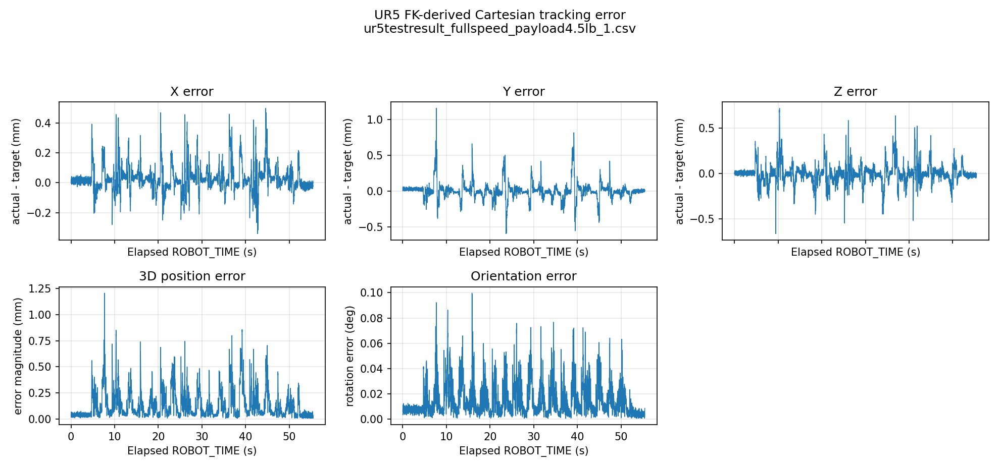

Error는 특정 동작 구간에서 반복적으로 peak를 형성하며 오른쪽 꼬리를 갖는다. 따라서 평균값만 비교하지 않고 전체 error 분포를 모델링한다.

현재 계산은 기본적으로 UR5 flange origin을 사용한다. 실제 TCP offset을 알고 있다면 다음처럼 지정할 수 있다.

```python
analyzer = UR5DegradationAnalyzer(tcp_offset_m=[tcp_x, tcp_y, tcp_z])
```

본 결과는 encoder joint position과 nominal kinematics에서 계산한 tracking error이며, 외부 측정장비로 측정한 absolute positioning accuracy는 아니다.

---

## 5. 신뢰도의 정의

Position과 orientation의 신뢰도는 각각 다음과 같이 정의한다.

$$
R_{pos}(s,L_{pos})
=P(E_{pos}\le L_{pos}\mid s)
$$

$$
R_{ori}(s,L_{ori})
=P(E_{ori}\le L_{ori}\mid s)
$$

예를 들어 $R_{pos}=0.95$는 해당 speed에서 전체 운전시간의 약 95% 동안 position error가 허용오차 이내에 있을 것으로 추정된다는 의미이다.

본 신뢰도는 다음 mission reliability와 다르다.

$$
P\left(\max_t E(t)\le L\right)
$$

즉, 한 번의 구동 동안 단 한 번도 허용오차를 초과하지 않을 확률이 아니라 `time-in-tolerance reliability`이다.

Position과 orientation의 독립성이 입증되지 않았으므로 두 확률을 곱하지 않는다. 각각의 최대 속도를 별도로 구한 뒤, 두 기준을 함께 적용할 때 더 낮은 속도를 선택한다.

---

## 6. 후보 Error Distribution과 MLE

다음 세 분포를 후보로 사용한다.

### Normal

$$
E\sim N(\mu,\sigma^2)
$$

### Lognormal

$$
\log E\sim N(\mu,\sigma^2)
$$

$$
F_E(L)=\Phi\left(\frac{\log L-\mu}{\sigma}\right)
$$

### Weibull

$$
F_E(L)=1-\exp\left[-\left(\frac{L}{\eta}\right)^\beta\right]
$$

각 분포의 파라미터는 maximum likelihood estimation으로 추정한다.

$$
\hat{\theta}
=\arg\max_{\theta}
\sum_{i=1}^{n}\log f(E_i;\theta)
$$

---

## 7. Probability Plot 기반 분포 선택

Probability plot은 분포별 표준 probability paper 좌표로 변환하여 작성한다.

- Normal: $x=E_{(i)}$, 내부 y좌표 $=\Phi^{-1}(p)$
- Lognormal: $x=\log E_{(i)}$, 내부 y좌표 $=\Phi^{-1}(p)$
- Weibull: $x=\log E_{(i)}$, 내부 y좌표 $=\log[-\log(1-p)]$

여기서 plotting position은 다음과 같다.

$$
p_i=\frac{i-0.5}{n}
$$

내부 y좌표는 선형성 검정을 위한 분포별 변환값이지만, 그림의 y축 눈금은 `0.001`부터 `0.999`까지 실제 누적확률 $F(E)$로 표시한다. 확률 0과 1은 변환좌표에서 각각 무한대가 되므로 끝점 자체는 표시하지 않는다.

분포가 자료에 적합하면 probability paper 위의 점들이 다음 직선 주변에 놓인다.

$$
y=a+bx
$$

따라서 각 probability plot에 절편을 포함한 선형회귀선을 적합하고 다음 결정계수를 계산한다.

$$
R^2
=\operatorname{Corr}
\left(Q_{theoretical},Q_{observed}\right)^2
$$

Position/orientation과 speed 0.5/1.0을 조합한 네 데이터셋에서 하나의 공통 분포 family를 선택한다.

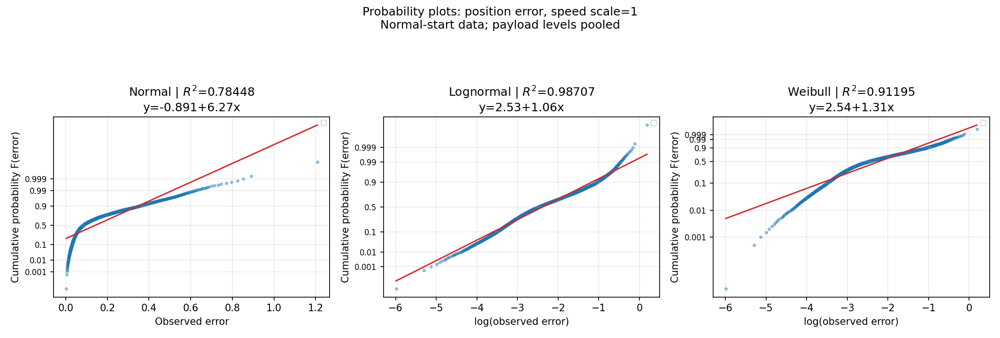

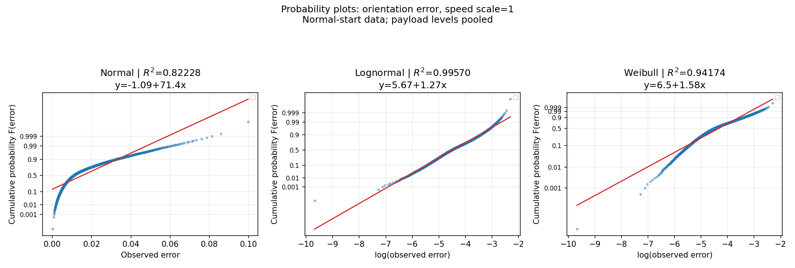

| 분포 | 평균 Probability Plot $R^2$ | 최소 $R^2$ | 평균 AIC 순위 | 선택 |
|---|---:|---:|---:|---|
| Lognormal | **0.9929** | **0.9871** | **1.0** | **선택** |
| Weibull | 0.9439 | 0.9119 | 2.0 |  |
| Normal | 0.8037 | 0.7817 | 3.0 |  |

종합 적합도가 가장 우수한 Lognormal distribution을 이후 분석의 공통 모델로 고정한다.

그림의 적색선은 실제 선형회귀선이며, 제목에는 회귀식과 $R^2$가 표시된다. 기존의 $y=x$ 기준선은 분포별 변환축에서 필수 조건이 아니므로 모델 선택 기준으로 사용하지 않는다. Lognormal은 중앙부와 대부분의 분위수에서 거의 선형이지만 양쪽 극단에서는 일부 이탈이 남아 있으므로, 매우 희귀한 tail 확률은 보수적으로 해석해야 한다.

---

## 8. 선택된 Lognormal 파라미터

SciPy parameterization에서 `shape_sigma`는 $\sigma$, `scale_exp_mu`는 $\exp(\mu)$이다.

| Error metric | Speed | $\sigma$ | $\exp(\mu)$ | Probability Plot $R^2$ |
|---|---:|---:|---:|---:|
| Position | 0.5 | 0.79832 | 0.07160 | 0.99653 |
| Position | 1.0 | 0.93577 | 0.09239 | 0.98707 |
| Orientation | 0.5 | 0.72500 | 0.00975 | 0.99240 |
| Orientation | 1.0 | 0.78743 | 0.01136 | 0.99570 |

Speed 증가에 따라 두 error 모두 shape와 scale이 증가한다. 즉 error의 대표 크기뿐 아니라 분포의 산포와 상단 꼬리도 증가하는 방향으로 해석할 수 있다.

---

## 9. Speed에 따른 파라미터 선형 보간

시험 speed가 0.5와 1.0 두 수준뿐이므로, 이 구간에서 각 분포 파라미터가 선형으로 변화한다고 가정한다.

$$
\theta_k(s)
=\theta_k(0.5)
+\frac{s-0.5}{1.0-0.5}
\left[\theta_k(1.0)-\theta_k(0.5)\right]
$$

$$
0.5\le s\le1.0
$$

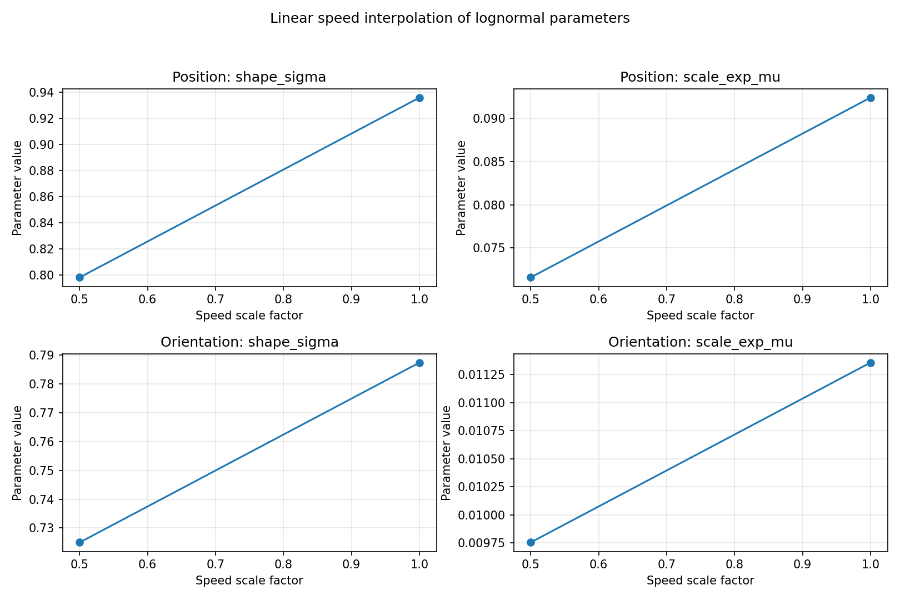

중간 speed의 실제 자료가 없으므로 이 관계는 검증된 물리 법칙이 아니라 제한된 구간의 model-based interpolation 가정이다.

---

## 10. Position Error 단일 제약 분석

Position reliability는 다음과 같다.

$$
R_{pos}(s,L_{pos})
=\Phi\left[
\frac{\log L_{pos}-\mu_{pos}(s)}{\sigma_{pos}(s)}
\right]
$$

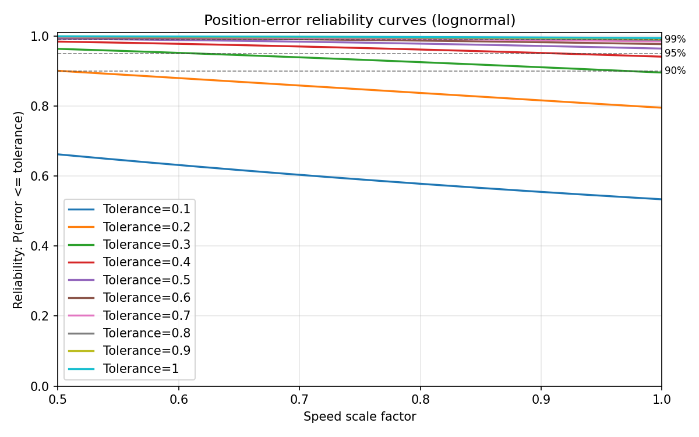

허용오차와 요구 신뢰도에 따른 position 기준 최대 속도는 다음 그림과 같다.

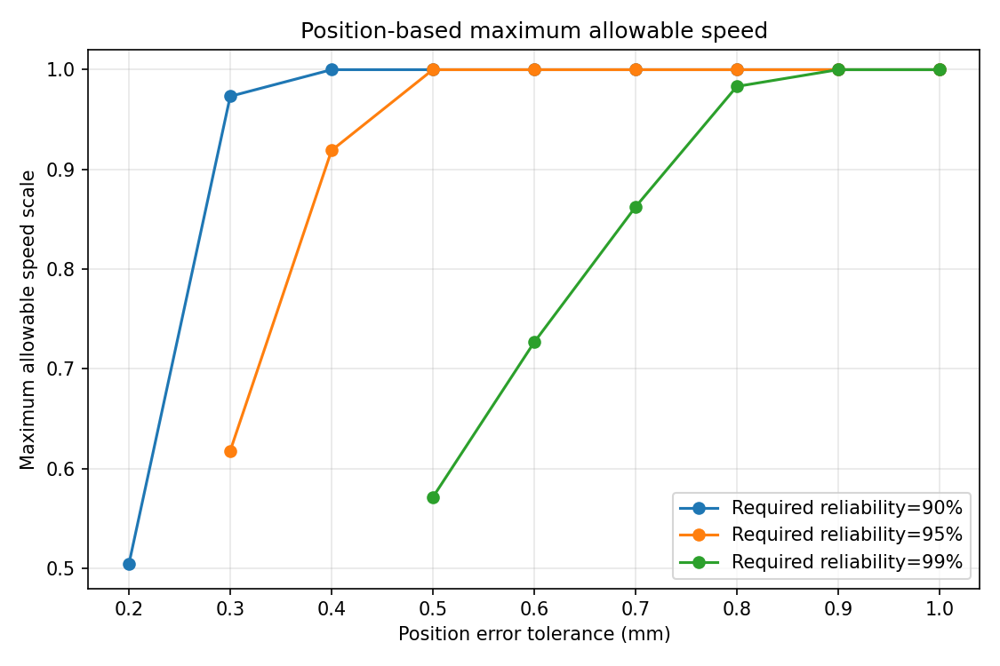

대표 결과는 다음과 같다.

| Position tolerance | 요구 신뢰도 | Position 기준 최대 speed |
|---:|---:|---:|
| 0.20 mm | 90% | 0.5044 |
| 0.30 mm | 90% | 0.9733 |
| 0.30 mm | 95% | 0.6179 |
| 0.40 mm | 95% | 0.9190 |
| 0.50 mm | 99% | 0.5714 |
| 0.70 mm | 99% | 0.8624 |
| 0.90 mm | 99% | 1.0000 |

Position 허용오차가 엄격하거나 요구 신뢰도가 높을수록 최대 speed가 감소한다. 예를 들어 0.3 mm 허용오차에서는 90% 신뢰도일 때 speed 0.9733까지 가능하지만, 95%로 높이면 0.6179로 감소한다. 99%에서는 speed 0.5도 기준을 만족하지 못한다.

---

## 11. Orientation Error 단일 제약 분석

Orientation reliability는 다음과 같다.

$$
R_{ori}(s,L_{ori})
=\Phi\left[
\frac{\log L_{ori}-\mu_{ori}(s)}{\sigma_{ori}(s)}
\right]
$$

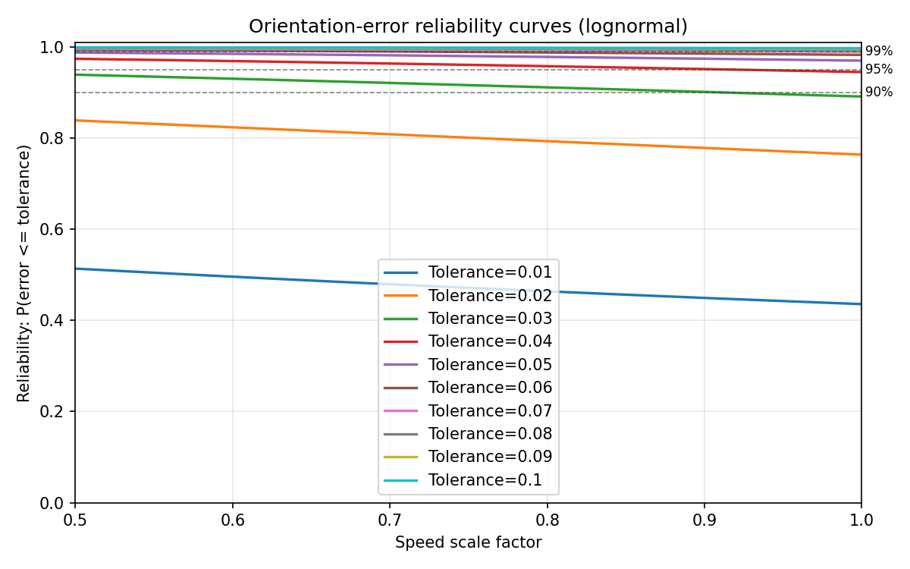

허용오차와 요구 신뢰도에 따른 orientation 기준 최대 속도는 다음 그림과 같다.

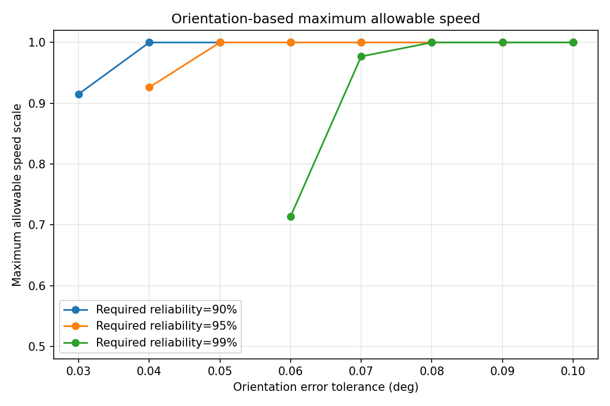

대표 결과는 다음과 같다.

| Orientation tolerance | 요구 신뢰도 | Orientation 기준 최대 speed |
|---:|---:|---:|
| 0.03 deg | 90% | 0.9152 |
| 0.04 deg | 90% | 1.0000 |
| 0.04 deg | 95% | 0.9262 |
| 0.05 deg | 95% | 1.0000 |
| 0.06 deg | 99% | 0.7138 |
| 0.07 deg | 99% | 0.9770 |
| 0.08 deg | 99% | 1.0000 |

Orientation tolerance 0.03 deg와 신뢰도 95%의 조합은 speed 0.5에서도 만족되지 않는다. 반면 tolerance가 0.05 deg 이상이면 95% 조건에서도 fullspeed가 허용된다.

---

## 12. 실용 권장속도 결정

Position과 orientation 분석 결과는 독립된 표로 유지한다. 실제 공정에서 두 tolerance가 모두 주어진 경우에만 다음 규칙을 적용한다.

$$
s_{recommended}
=\min\left[
s_{pos}^{*}(L_{pos},R_0),
s_{ori}^{*}(L_{ori},R_0)
\right]
$$

예를 들어 다음 조건을 고려한다.

```text
Position tolerance    = 0.30 mm
Orientation tolerance = 0.04 deg
Required reliability  = 95%
```

각 기준의 결과는 다음과 같다.

| 기준 | 최대 speed |
|---|---:|
| Position 기준 | 0.6179 |
| Orientation 기준 | 0.9262 |
| 최종 권장속도 | **0.6179** |

이 조건에서는 position error가 제한조건이다. 반대로 orientation 기준 속도가 더 낮은 조건에서는 orientation이 최종 속도를 결정한다.

어느 한 조건이 speed 0.5에서도 요구 신뢰도를 만족하지 못하면 최종 권장속도 역시 `not feasible`로 처리한다.

---

## 13. 코드 실행 방법

전체 분석은 다음 명령으로 실행한다.

```powershell
python analysis.py
```

신뢰성 분석만 호출하려면 다음과 같이 사용한다.

```python
from analysis import UR5DegradationAnalyzer

analyzer = UR5DegradationAnalyzer()
analyzer.load_all()

result = analyzer.run_speed_reliability_analysis(
    position_tolerances_mm=[i * 0.1 for i in range(1, 11)],
    orientation_tolerances_deg=[i * 0.01 for i in range(1, 11)],
    required_reliabilities=[0.90, 0.95, 0.99],
)
```

하나의 position 조건만 계산하는 예시는 다음과 같다.

```python
position_decision = analyzer.maximum_allowable_speed(
    fits=result["fits"],
    selected_distribution=result["selected_distribution"],
    metric="position",
    tolerance=0.3,
    required_reliability=0.95,
)
```

Orientation 조건은 `metric="orientation"`과 degree 단위 tolerance를 사용한다.

---

## 14. Payload 영향에 대한 정량 검토

Payload pooling의 타당성을 확인하기 위해 8 ms sample을 독립 반복으로 사용하지 않고, 각 CSV 파일을 하나의 replicate로 취급하였다. 각 run에서 mean, median, p95, p99를 계산한 뒤 다음 두 효과를 동일한 상대변화율로 비교하였다.

### Payload 효과

Speed를 고정하고 payload가 1.6 lb에서 4.5 lb로 증가할 때의 변화율:

$$
\Delta_{payload}
=\left(
\frac{M_{4.5}}{M_{1.6}}-1
\right)\times100\%
$$

### Speed 효과

Payload를 고정하고 speed가 0.5에서 1.0으로 증가할 때의 변화율:

$$
\Delta_{speed}
=\left(
\frac{M_{1.0}}{M_{0.5}}-1
\right)\times100\%
$$

$M$은 run별 median, p95 또는 p99의 조건 평균이다. 불확실성은 세 개 run을 재표집하는 run-level bootstrap 95% interval로 평가하였다.

### 14.1 Run별 비교

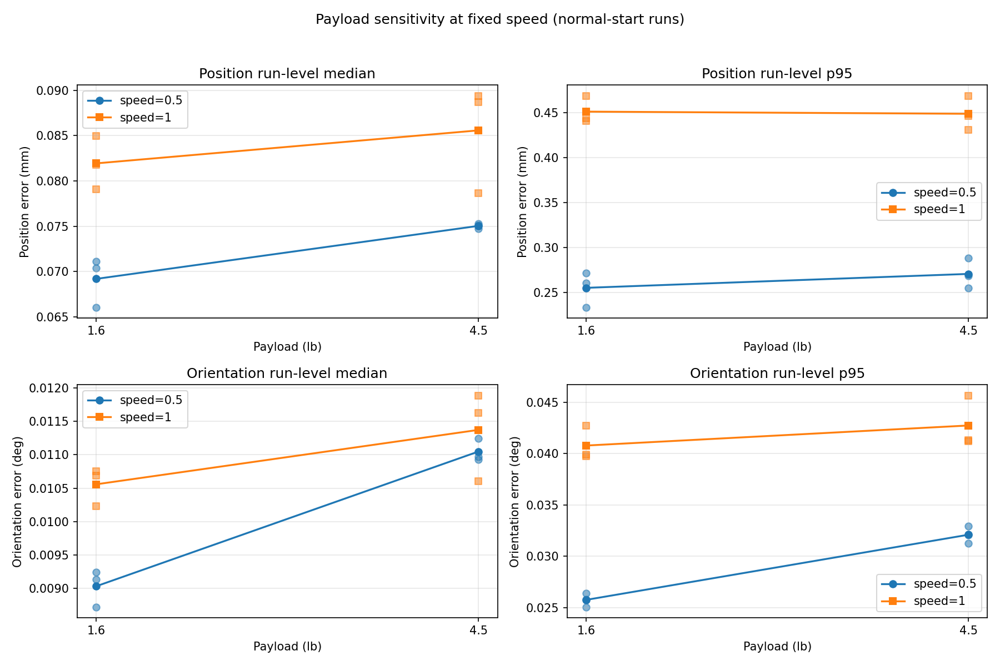

Position error에서는 동일 speed 내 payload 차이가 작고, speed 0.5와 1.0 사이의 차이가 더 크다. Orientation error에서는 fullspeed의 payload 차이는 작지만 halfspeed에서 4.5 lb가 1.6 lb보다 일관되게 높다.

### 14.2 Payload 효과와 Speed 효과의 크기

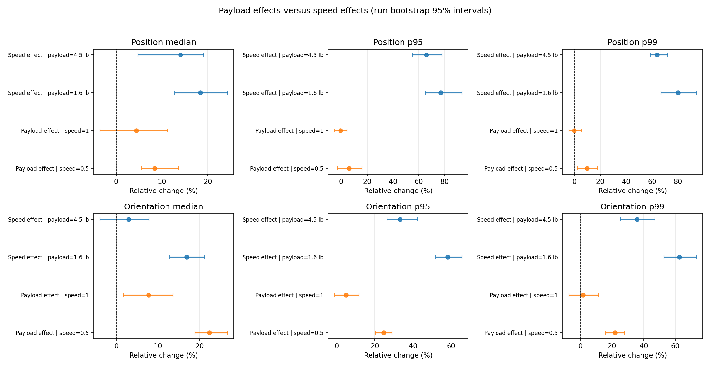

대표 상대변화율은 다음과 같다.

| Metric | Statistic | Payload 효과, speed 0.5 | Payload 효과, speed 1.0 | Speed 효과 범위 |
|---|---|---:|---:|---:|
| Position | Median | +8.4% | +4.4% | +14.0% ~ +18.4% |
| Position | p95 | +6.1% | -0.5% | +65.9% ~ +76.9% |
| Position | p99 | +9.8% | -0.1% | +63.9% ~ +80.0% |
| Orientation | Median | +22.3% | +7.7% | +2.9% ~ +16.9% |
| Orientation | p95 | +24.6% | +4.8% | +33.1% ~ +58.3% |
| Orientation | p99 | +21.8% | +1.6% | +35.6% ~ +62.6% |

Position p95와 p99에서는 speed 효과가 payload 효과보다 압도적으로 크다. 따라서 **position reliability 모델에서 payload를 pooling하는 논리는 비교적 강하게 지지된다.**

Orientation p95와 p99에서도 speed 효과가 더 크지만, halfspeed에서 payload 효과가 약 22-25%로 나타난다. 따라서 **orientation error에 대해 payload 영향이 거의 없다고 단정할 수는 없다.**

### 14.3 Empirical CDF 비교

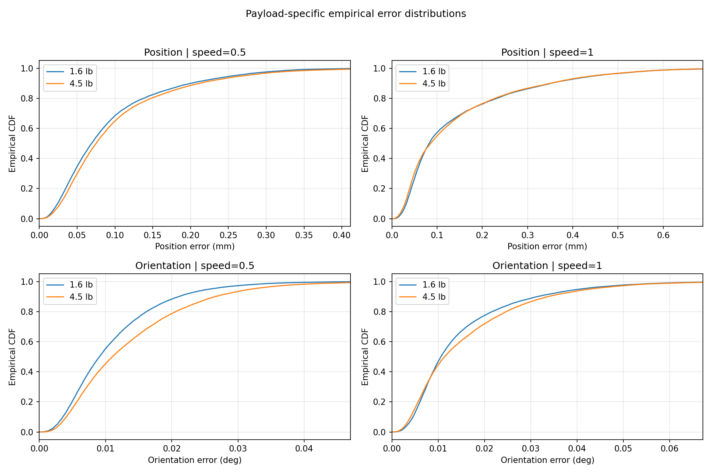

Position fullspeed의 두 ECDF는 거의 겹치며, halfspeed에서도 차이가 제한적이다. Orientation halfspeed에서는 4.5 lb 분포가 오른쪽으로 이동하여 payload 효과가 시각적으로도 확인된다.

### 14.4 권장속도에 미치는 영향

통합 모델과 payload별 Lognormal 모델에서 계산한 최대 speed를 직접 비교하였다.

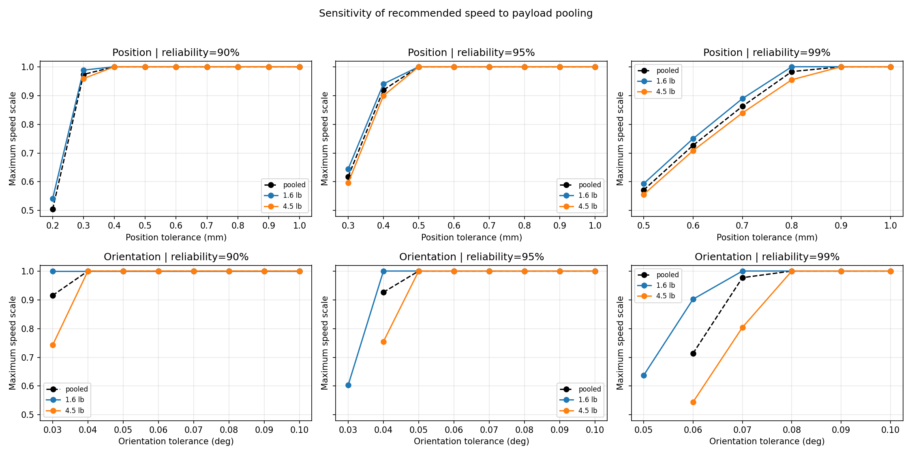

Position 기준 권장속도는 payload별 결과가 통합 모델 주변에 가깝게 위치한다.

예를 들어 position tolerance 0.3 mm, 요구 신뢰도 95%에서:

| 모델 | 최대 speed |
|---|---:|
| 1.6 lb 모델 | 0.6443 |
| Pooled 모델 | 0.6179 |
| 4.5 lb 모델 | 0.5958 |

통합 모델은 두 payload 결과 사이에 위치하며 4.5 lb 모델보다 약간 덜 보수적이다.

Orientation에서는 차이가 더 크다. Orientation tolerance 0.04 deg, 요구 신뢰도 95%에서:

| 모델 | 최대 speed |
|---|---:|
| 1.6 lb 모델 | 1.0000 |
| Pooled 모델 | 0.9262 |
| 4.5 lb 모델 | 0.7547 |

따라서 payload와 무관한 하나의 속도를 제안해야 한다면 다음 원칙이 적절하다.

- Position 기준: pooled model 사용 가능
- Orientation 기준: payload별 모델을 사용하거나, 전체 payload 범위를 포괄하려면 4.5 lb 모델을 보수적으로 사용

즉, 추가 분석은 “payload 영향이 없다”는 주장을 완전히 입증하기보다 다음과 같은 더 방어력 있는 결론을 제공한다.

> Position tracking error에서는 speed가 지배적인 요인이며 payload pooling의 영향이 제한적이다. Orientation tracking error에서는 payload 영향이 특히 halfspeed에서 존재하므로 별도 sensitivity 또는 보수적 처리가 필요하다.

---

## 15. 생성 결과물

결과는 `output/reliability/`에 저장된다.

| 파일 | 내용 |
|---|---|
| `probability_plots/` | 후보 분포별 probability plot |
| `distribution_fits/` | Histogram과 MLE PDF 비교 |
| `distribution_fit_details.csv` | MLE, log-likelihood, AIC, $R^2$ |
| `model_selection_summary.csv` | 분포별 종합 선택 결과 |
| `selected_model.txt` | 최종 선택 분포 |
| `selected_model_parameters.csv` | 선택 분포의 endpoint 파라미터 |
| `selected_parameter_interpolation.png` | Speed별 파라미터 보간 |
| `position_reliability_curves.png` | Position 신뢰도 곡선 |
| `orientation_reliability_curves.png` | Orientation 신뢰도 곡선 |
| `position_maximum_speed_table.csv` | Position 기준 최대 speed 표 |
| `orientation_maximum_speed_table.csv` | Orientation 기준 최대 speed 표 |
| `position_maximum_speed_by_tolerance.png` | Position tolerance별 speed limit |
| `orientation_maximum_speed_by_tolerance.png` | Orientation tolerance별 speed limit |
| `practical_recommended_speed_table.csv` | 두 결과의 최솟값을 사용한 실용 권장속도 |

Payload sensitivity 결과는 `output/payload_sensitivity/`에 저장된다.

| 파일 | 내용 |
|---|---|
| `run_level_error_summary.csv` | 각 run의 mean, median, p95, p99 |
| `condition_error_summary.csv` | Speed-payload 조건별 run 요약 |
| `payload_vs_speed_effects.csv` | Payload 및 speed 상대효과와 bootstrap interval |
| `payload_run_level_comparison.png` | 고정 speed에서 payload별 run 비교 |
| `payload_vs_speed_effect_comparison.png` | Payload 효과와 speed 효과 비교 |
| `payload_empirical_cdf.png` | Payload별 경험적 error 분포 |
| `payload_specific_speed_limits.csv` | Pooled 및 payload별 최대 speed |
| `payload_specific_speed_limit_comparison.png` | 모델별 권장속도 민감도 |

---

## 16. 결론

본 프로젝트는 position과 orientation tracking error를 각각 확률분포로 모델링하고, 허용오차와 요구 신뢰도에 따른 최대 speed scale factor를 독립적으로 산출한다.

주요 결과는 다음과 같다.

1. Normal, Lognormal, Weibull 중 Lognormal 분포가 종합적으로 가장 적합했다.
2. Speed 증가에 따라 position과 orientation error 분포의 shape와 scale이 증가했다.
3. Position p95/p99에서 speed 효과는 약 64-80%, payload 효과는 약 -1-10%로 speed가 지배적이었다.
4. Position과 orientation을 분리하여 각 error가 허용하는 최대 speed를 직접 확인할 수 있다.
5. Orientation에서는 halfspeed의 payload 효과가 약 22-25%이므로 payload 무시를 일반화할 수 없다.
6. 실제 운전에서는 두 speed 중 더 작은 값을 선택하며, payload-independent orientation 기준이 필요하면 4.5 lb 모델을 보수적으로 고려한다.
7. 요구 신뢰도가 높아지거나 tolerance가 엄격해질수록 허용 가능한 speed가 감소한다.

즉, 본 프로젝트의 최종 의사결정은 다음과 같다.

> Position과 orientation의 신뢰 운전속도를 각각 계산하고, 실제 적용 시 더 보수적인 속도를 선택한다.

---

## 17. 해석상의 한계

1. Speed level이 0.5와 1.0 두 개뿐이므로 중간 speed의 선형성은 직접 검증되지 않았다.
2. 중간 speed 결과는 시험범위 내부의 model-based interpolation이다.
3. 조건당 run이 세 개뿐이므로 payload bootstrap interval과 payload별 speed limit의 불확실성이 크다.
4. 0.008초 간격 sample은 자기상관을 가지므로 독립 표본으로 볼 수 없다.
5. 신뢰도는 전체 mission의 무초과 확률이 아니라 time-in-tolerance probability이다.
6. 매우 희귀한 극단 tail에서 분포 적합의 불확실성이 커질 수 있다.
7. Cold-start, 시험 payload 범위 외부 및 speed 0.5-1.0 외부에는 적용할 수 없다.
8. 실제 적용 전에는 추정 경계 speed 부근에서 추가 검증시험이 필요하다.
